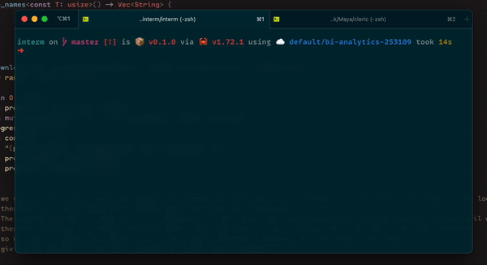

# InTerm: Interactive Terminal Library for Rust
[](./LICENSE)
[](https://crates.io/crates/interm)
[](https://docs.rs/interm)

InTerm is a Rust library designed to facilitate the creation of interactive terminal applications. It provides a simple and flexible way to create and manage interactive elements within the terminal, allowing for interactive and dynamic user interfaces.

---

⚠️ **Disclaimer**: This project is still very much a work in progress, and contributions from the community are highly encouraged and appreciated! If you're interested in contributing, please read our [contribution guidelines](CONTRIBUTING.md) :)

---

## Table of Contents

- [Features](#features)
- [Usage](#usage)
- [Examples](#examples)
- [Contributing](#contributing)
- [License](#license)

## Features

- **Block Structure**: Represents a block of interactive elements or indexed lines in the terminal, consisting of a vector of `InteractiveElement` instances.
- **InteractiveLine**: Represents a line that can be updated in the terminal. It is used within the `Block` structure to manage individual lines.
- **Cursor Management**: Provides functions to control the cursor position and visibility within the terminal.
- **Line Clearing**: Allows for clearing a specific line or all interactive element lines in the terminal.

## Usage

To use InTerm in your Rust project, follow these steps:

1. Add the `interm` dependency to your `Cargo.toml`:

   ```toml
   [dependencies]
   interm = "0.1.0"
   ```

2. Import the necessary modules into your Rust code:

   ```rust
   use interm::{Block, interactive::Line as InteractiveLine};
   ```

3. Create a `Block` and interact with interactive elements:

   ```rust
   let mut elements: Vec<InteractiveLine> = Vec::with_capacity(10);
   for idx in 0..10 {
       elements.push(InteractiveLine::new(format!("Download {}", idx).as_str()));
   }

   let block = Block::new(elements).unwrap();

   // Update an element
   let elem = &block.interactive_lines[0];
   block.update_element(elem, "Download 0: Complete", true).unwrap();

   // Go to an element
   block.goto_idx(0).unwrap();

   // Clear a line
   block.clear_line().unwrap();

   // Clear all lines
   block.clear_lines().unwrap();
   ```

## Examples

Check the [examples](examples) directory for more usage examples.



## Contributing

We welcome contributions from the community! If you find a bug or have an idea for an improvement, please read the [contribution guidelines](CONTRIBUTING.md) and open an issue or create a pull request.

## License

This project is licensed under the [MIT License](LICENSE).
